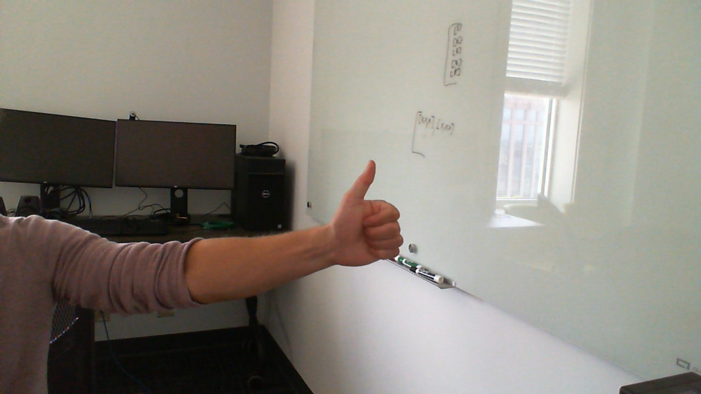
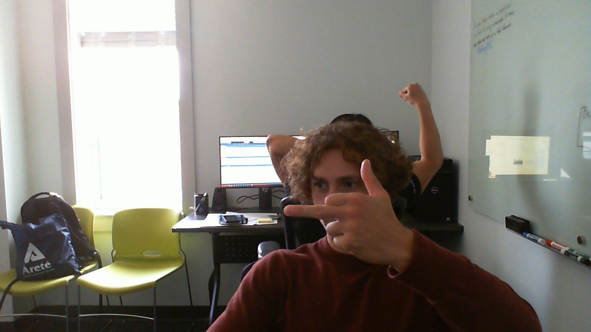
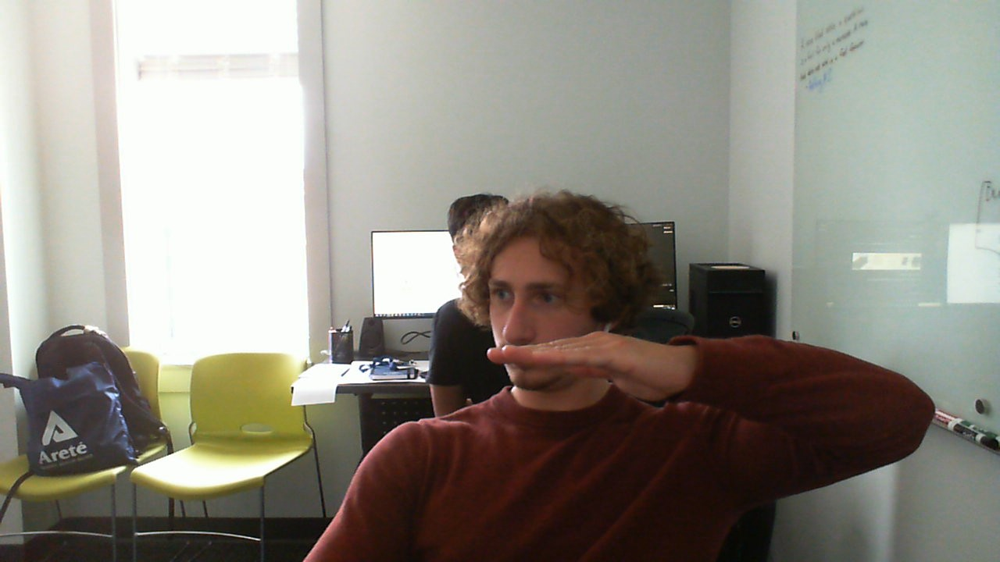

# ASL Detector
This project uses computer vision and mediapipe's customizable gesture recognition to detect American Sign Language in a live video feed. 

## Use
To use the detecor, run the main file **ASL_detector.py**. The file will use open your webcam and use the pretrained **asl.task** to detect any sign language in the feed. Detected letters will appear on the webcam window. Once a letter is detected, the user can press the enter key on their keyboard to write this letter (or a space) to a text file. Once the program is ended, a txt file with the messaged will be saved in the users directory.

## Training
A dataset of close to 3,000 images of hand gestures was created. This dataset was custom made using a webcam and can be easily recreated. To train your own model with custom gestures, use the  **train_task.py** file with your own data.

**Note:** The program follows conventional ASL gestures with the exception of "J" and "Z" as they involve the tracking of a moving gesture which was outside the scope of this project. To resolve this issue, custom gestures were made for this letters:

J:

Z: 

Space:

Included in this repo:
- **ASL_Detector.py** - Main file
- **asl.task** - Trained Mediapipe task for use in the main file.
- **ASL_Detection_example** - Example video of program.
- **ASL_Gesture_examples** - A folder with a few examples of unique letters.
- **train_task.py** - Mediapipe's method of training a model from images.
- **requirements.txt** - Requirements for python enviroment.

Example of Program used to write Hello World:
<video src="https://github.com/user-attachments/assets/30ae5c6d-c4ef-49b6-b7d4-c4153a432ed0" width="320" height="240" controls></video>
